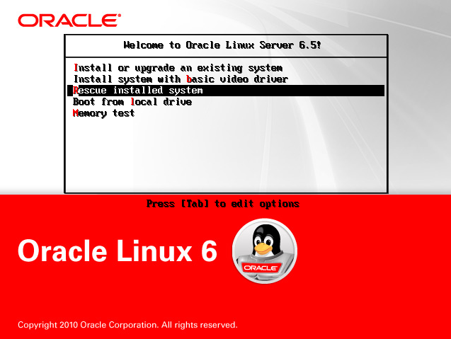
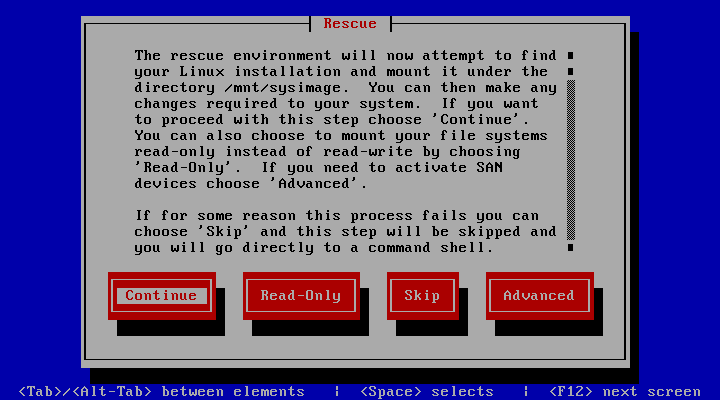
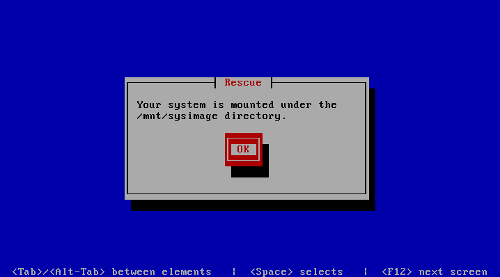

# Linux 配置及应用

> 个人日常使用发行版为 [Linux Mint](https://www.linuxmint.com/), Debian 系发行版大部分可套用或稍加改动使用。RedHat 系发行版可能随之后的使用情况而修订增加相关内容。
>
> 部分内容为使用 centos 或 oracle linux 中的内容，非 RedHat 系发行版需要搜索以确认相同配置文件的不同路径及其它差异。
>
> *Linux 发行版的区别大同小异，学习 Linux 重在学习一种通用的解决方案或思路，不必过分纠结使用何种发行版，迷失在发行版之间差异的细枝末节中！*

* [Linux 配置及应用](#linux-mint-配置及应用)
     * [基本配置](#基本配置)
         * [联网](#联网)
         * [终端](#终端)
            * [bd](#bd)
         * [内核回退](#内核回退)
         * [字体](#字体)
         * [美化](#美化)
         * [输入法](#输入法)
            * [输入法词库](#输入法词库)
         * [Java 开发环境配置](#java-开发环境配置)
         * [NFS 附件共享](#nfs-附件共享)
         * [Unison 文件同步](#unison-文件同步)
     * [应用软件](#应用软件)
         * [浏览器](#浏览器)
         * [Chrome Apps](#chrome-apps)
         * [编辑器](#编辑器)
         * [Markdown 写作](#markdown-写作)
         * [效率](#效率)
         * [开发环境](#开发环境)
         * [同步工具](#同步工具)
         * [代理工具](#代理工具)
         * [文档阅读](#文档阅读)
         * [办公教育](#办公教育)
         * [下载工具](#下载工具)
         * [系统管理](#系统管理)
     * [Windows 兼容](#windows-兼容)
         * [虚拟机 Tips](#虚拟机-Tips)
            * [VMWare 克隆虚拟机后克隆机无法连接网络](#vmware-克隆虚拟机后克隆机无法连接网络)
     * [Tips](#tips)
         * [Linux Mint 安装 git-lfs](#linux-mint-安装-git-lfs)
         * [普通用户无法使用-sudo](#普通用户无法使用-sudo)
         * [救援模式更改 root 密码](#救援模式更改-root-密码)
         * [配置密钥登陆](#配置密钥登陆)
            * [开启免密登陆](#开启免密登陆)
            * [配置 Linux 服务器仅使用密钥认证](#配置-linux-服务器仅使用密钥认证)
         * [计划任务](#计划任务)
         * [使用本地镜像源](#使用本地镜像源)
         * [LVM 磁盘挂载、扩容、分区](#lvm-磁盘挂载扩容分区)
            * [创建和管理 LVM](#创建和管理-lvm)
            * [错误执行 lvreduce 后的恢复](#错误执行-lvreduce-后的恢复)
         * [建立 Swap 分区](#建立-swap-分区)
            * [创建用于交换分区的文件](#创建用于交换分区的文件)
            * [设置交换分区文件](#设置交换分区文件)
            * [立即启用交换分区文件](#立即启用交换分区文件)
            * [开机时启用 swap 分区](#开机时启用-swap-分区)
         * [更改主机名](#更改主机名)
            * [方法一](#方法一)
            * [方法二](#方法二)


## 基本配置

### 联网

1. 锐捷官方客户端

   ```bash
   sudo chmod +x ./rjsupplicant.sh
   sudo ./rjsupplicant.sh --help # 配置使用
   ```

2. Mentohust

   安装 [mentohust_0.3.4-1_amd64.deb](https://storage.googleapis.com/google-code-archive-downloads/v2/code.google.com/mentohust/mentohust_0.3.4-1_amd64.deb) 包。

   Mentohust 使用 `notify-osd` `libnotify-dev` 提供气泡提示（Unity 桌面默认通知方式，Cinnamon 桌面需要手动安装包）。关于通知的文档：https://wiki.archlinux.org/index.php/Desktop_notifications

   ```bash
   # 修复提示 “！！打开libnotify失败，请检查是否已安装该库文件。”
   sudo ln -s /usr/lib/x86_64-linux-gnu/libnotify.so.4.0.0 /usr/lib/libnotify.so.1
   ```

   配置文件位置 `/etc/mentohust.conf`:

   组播地址：标准

   DHCP 方式：二次认证

### 终端

安装 zsh:

```bash
sudo apt-get install zsh
```

切换默认 zsh:

```bash
chsh -s /bin/zsh
```

安装 `oh-my-zsh`:

```bash
sh -c "$(wget https://raw.githubusercontent.com/robbyrussell/oh-my-zsh/master/tools/install.sh -O -)"
```

配置文件 `~/.zshrc`:

```bash
# 定义 zsh 主题
ZSH_THEME="ys"

# 设置别名
alias sudo="sudo "                # 授予 sudo 别名权限
alias rj="mentohust"              # 联网
alias qrj="mentohust -k"          # 退出联网
# alias xl="docker start xware"   启动讯雷下载容器
# alias qxl="docker stop xware"   停止讯雷远程下载容器
```

#### [bd](https://github.com/vigneshwaranr/bd)

`bd` 可以方便地在当前路径的父级别目录切换，安装可以点击项目链接查看文档中的安装说明。

> 默认安装不会在非 bash 终端中配置 `bd` 运行的别名，需要手动设置。
>
> 例如使用 `zsh` 终端，需要在 `.zshrc` 中增加：
>
> ```shell
> alias bd=". bd -si"
> ```

### 内核回退


### 字体

下载符号字体解决 wps 符号字体缺失：

[symbol-fonts_1.2_all.deb](https://pan.baidu.com/share/link?uk=505215462&shareid=3369982571)

下载全套 Windows 字体：

[winfonts_1.3_all.deb](https://pan.baidu.com/share/link?uk=505215462&shareid=1223565760)

同时使用 Infinality 优化字体渲染：

> 参考文章：http://www.webupd8.org/2013/06/better-font-rendering-in-linux-with.html

```bash
sudo add-apt-repository ppa:no1wantdthisname/ppa
sudo apt-get update
sudo apt-get upgrade
sudo apt-get install fontconfig-infinality
```

设置风格为 `Infinality`：

```bash
sudo bash /etc/fonts/infinality/infctl.sh setstyle
```

设置渲染风格：

```bash
# 修改 USE_STYLE 为 UBUNTU
sudo vim /etc/profile.d/infinality-settings.sh
```

启用 `Hinting full`。

### 美化

1. 壁纸

   安装所有 Linux Mint 历史版本自带壁纸：

   ```bash
   sudo apt-get install mint-backgrounds-*
   ```

2. 图标

   1. 经典 Numix-Circle 图标适配全，更新快：

      ```bash
      sudo add-apt-repository ppa:numix/ppa
      sudo apt-get update
      sudo apt-get install numix-icon-theme-circle
      ```

   2. 扁平化 Paper 图标，适合扁平化主题：

      ```shell
      sudo add-apt-repository ppa:snwh/pulp
      # update repository info
      sudo apt-get update
      # install icon theme
      sudo apt-get install paper-icon-theme
      # install gtk theme
      sudo apt-get install paper-gtk-theme
      # install cursor theme
      sudo apt-get install paper-cursor-theme
      ```

3. 主题

   1. 添加 Numix PPA 后，安装 gtk 主题：

      ```bash
      sudo apt-get install numix-gtk-theme
      ```

      对于 Cinnamon 桌面而言，改变 Panel 主题可下载 `Numix-Cinnamon-2` 主题设置使用。

   2. 添加 Adapta PPA 后，安装主题：

      ```shell
      sudo apt-get install adapta-gtk-theme
      ```

4. 登录窗口

   同样选择 Numix 主题来统一风格，自定义背景修改 `/usr/share/mdm/html-themes` 路径下主题文件。

### 输入法

Fcitx 搭配 Cinnamon 会产生一个僵尸进程，搜狗输入法容易导致概率性 CPU 占用 100%。所以使用[小小输入法](http://yongim.ys168.com/)。

解压到主目录 `~/.yong`:

```bash
sudo chmod +x ./yong-tool.sh
sudo ./yong-tool.sh --install
```

#### 输入法词库

小小输入法内置词库少，可使用工具将其他词库转换后导入：https://github.com/studyzy/imewlconverter

导入说明：https://github.com/studyzy/imewlconverter/wiki/Xiaoxiao

### Java 开发环境配置

默认 JDK 安装：

```shell
sudo apt-get update
sudo apt-get install default-jre
```

Oracle JDK 安装：

```shell
sudo add-apt-repository ppa:webupd8team/java
sudo apt-get update
sudo apt-get install oracle-java6-installer # JDK 6
sudo apt-get install oracle-java7-installer # JDK 7
sudo apt-get install oracle-java8-installer # JDK 8
```

版本之间切换：

```shell
update-alternatives --config java
update-alternatives --config javac
```

### NFS 附件共享

#### 安装
客户端和服务端分别安装相关软件
```shell
yum -y install rpcbind nfs
chkconfig rpcbind on # 开机启动 rpcbind 服务
chkconfig nfs on # 开机启动 nfs 服务
```
启动相关服务：
```shell
service rpcbind start
service nfs start
```
> 以下示例中，分别使用两台本地虚拟机测试，服务端 ip:192.168.221.100，客户端 ip:192.168.221.101

#### 服务端配置
编辑配置文件 `/etc/exports`
添加
`/home/uploads 192.168.221.101(rw,all_squash,anonuid=0,anongid=0)`
id 为文件夹所属的 uid 和 gid.
查看该 uid 和 gid:
```shell
ls -nd /home/uploads
```
> 在 NFS 服务端，若该用户不存在，则会显示相应的 uid 和 gid 而非用户名和组名，需要在服务端创建 uid 和 gid 对应的用户名和组名，即可正确显示。

配置说明：
```
192.168.221.101 客户端 ip
rw 读写 ro 只读
all_squash 无论客户端以何用户连接服务端，对服务端而言均为匿名用户
anonuid 匿名用户的 uid
anongid 匿名用户的 gid
```
> uid 和 gid 最好为客户端和服务端均存在的 uid 和 gid 值

#### 配置生效
执行：
```shell
service rpcbind restart
service nfs restart
# service nfs reload   调整 /etc/exports 配置文件后进行服务重载
```

##### 查看
服务端使用 showmount 命令查看 nfs 的共享状态
```shell
showmount -e # 默认查看自己的状态，前提是要能解析自己
showmount -a # 显示已经与客户端连接的目录信息
```
客户端查看
```shell
showmount -e 192.168.221.100
```
成功则显示目录，失败则会报错

##### 错误解决
1.  执行客户端查看命令后报错
    > `clnt_create: RPC: Port mapper failure - Unable to receive: errno 113 (No route to host)`
    > 在服务端防火墙配置添加端口规则：

    ```shell
    -A INPUT -m state --state NEW -m tcp -p tcp --dport 111 -j ACCEPT
    -A INPUT -m state --state NEW -m udp -p udp --dport 111 -j ACCEPT
    -A INPUT -m state --state NEW -m tcp -p tcp --dport 875 -j ACCEPT
    -A INPUT -m state --state NEW -m udp -p udp --dport 875 -j ACCEPT
    -A INPUT -m state --state NEW -m tcp -p tcp --dport 2049 -j ACCEPT
    -A INPUT -m state --state NEW -m udp -p udp --dport 2049 -j ACCEPT
    ```
2.  执行上述操作后依然报错
    > `rpc mount export: RPC: Unable to receive; errno = No route to hostrpc mount export: RPC: Unable to receive; errno = No route to host`

    在客户端上执行 `rpcinfo  -p  192.168.221.100`
    查看列出的所有端口。

    在服务端上，将列出的所有端口在防火墙中配置通过：

    ```shell
    -A INPUT -m state --state NEW -m tcp -p tcp --dport 111 -j ACCEPT
    -A INPUT -m state --state NEW -m udp -p udp --dport 111 -j ACCEPT
    -A INPUT -m state --state NEW -m tcp -p tcp --dport 875 -j ACCEPT
    -A INPUT -m state --state NEW -m udp -p udp --dport 875 -j ACCEPT
    -A INPUT -m state --state NEW -m tcp -p tcp --dport 2049 -j ACCEPT
    -A INPUT -m state --state NEW -m udp -p udp --dport 2049 -j ACCEPT
    -A INPUT -m state --state NEW -m tcp -p tcp --dport 43888 -j ACCEPT
    -A INPUT -m state --state NEW -m udp -p udp --dport 39912 -j ACCEPT
    -A INPUT -m state --state NEW -m tcp -p tcp --dport 47611 -j ACCEPT
    -A INPUT -m state --state NEW -m udp -p udp --dport 10235 -j ACCEPT
    -A INPUT -m state --state NEW -m tcp -p tcp --dport 64815 -j ACCEPT
    -A INPUT -m state --state NEW -m udp -p udp --dport 54924 -j ACCEPT
    -A INPUT -m state --state NEW -m tcp -p tcp --dport 31590 -j ACCEPT
    -A INPUT -m state --state NEW -m udp -p udp --dport 62105 -j ACCEPT
    ```
    执行成功。
3.  若挂载目录为 `/root/*` 类似目录，则会报错：
    > `mount.nfs: access denied by server while mounting 192.168.221.100:/root/uploads/`

    原因是由于 `/root/` 目录权限问题，更改权限为 `755` 可解决，或者挂载非 `/root/` 目录。

#### 客户端配置
重启服务：
```shell
service rpcbind restart
service nfs restart
```
查看可用挂载
```shell
showmount -e 192.168.221.100
```
出错参见上述出错解决方案
#### 设置自动挂载
创建本地挂载目录，例如和服务器相同，使用 `/home/uploads` 目录。
编辑客户端 `/etc/fstab` 文件，追加一行
```
192.168.221.100:/home/uploads/ /home/uploads/ nfs defaults 0 0
```
挂载测试
```shell
mount -a
```
查看挂载
```shell
nfsstat -m
df -h
```
#### 卸载
```shell
umount -l /home/uploads
```
#### 测试
在服务端创建文件，看客户端是否共享，反之亦可。

### Unison 文件同步

#### 配置 SSH 免密登陆

同步文件的服务器之间要求配置免密登陆，参见 [配置密钥登陆](#配置密钥登陆)

#### 安装 Unison

在两台服务器同时安装 Unison.

官方仓库下载 https://github.com/bcpierce00/unison/releases 或直接下载编译好的 rpm 包。
[ftp://rpmfind.net/linux/dag/redhat/el6/en/x86_64/dag/RPMS/unison-2.40.63-1.el6.rf.x86_64.rpm](ftp://rpmfind.net/linux/dag/redhat/el6/en/x86_64/dag/RPMS/unison-2.40.63-1.el6.rf.x86_64.rpm)

安装：
```shell
rpm -ivh unison-2.40.63-1.el6.rf.x86_64.rpm
```

新建用户目录下 `.unison` 中的配置文件。
例：新建一个 `test.prf` 配置文件

```shell
# Unison preferences
# 全自动模式，接受缺省动作，并执行
batch = true
# 根据创建时间来比较，而非内容，建议开启
fastcheck = true
# 保持同步文件的文件组信息
group = true
# 忽略文件
ignore = Path a/*
log = true
# 日志文件路径，需要先创建
logfile = /root/unison/logs/webapp.log
# 同步时最大线程数
maxthreads = 300
# 保持同步过来的文件所有者
owner = true
# 保持读写权限
perms = -1
# 间隔 60 秒开始一次新的同步检查
repeat = 60
# 失败重试次数
retry = 3
# 本地同步目录
root = /root/100
# 远程同步目录
root = ssh://root@192.168.221.100//root/101
# 第一次同步需要开启追踪所有文件，之后关闭来实现差异性同步，该配置同本地 root 配置
force = /root/100
# 激活 rsync 传输模式
rsync = true
# 静默模式
silent = true
# 同步修改时间
times = true
# 不变目录，扫描时可忽略
xferbycopying = true
```

#### 配置脚本
新建或编辑 `../unison/scripts/test.sh`.
检测 unison 状态
```shell
#!/bin/bash
result=`ps -ef | grep "/usr/bin/unison test" | grep -v grep`;
if [ -z "$result" ];then
/usr/bin/unison test;
fi
```
配置脚本定时启动
```shell
crontab -e

sh ../unison/scripts/test.sh >/dev/null 2>&1
```
#### 查看日志
查看配置参数中指定的日志文件。

#### 重新同步
1.  注释配置文件中的 force 参数
2.  运行 `unison test` 进行同步
3.  注释配置文件中的 force 参数

## 应用软件

### 浏览器

1. Chrome

   ```bash
   wget https://dl.google.com/linux/direct/google-chrome-stable_current_amd64.deb
   ```


2. Firefox Dev

   ```bash
   # 使用 Umake 安装
   umake web firefox-dev 
   ```

### Chrome Apps

1. Google Keep
2. 豆瓣电台
3. Enjoy Music Player
4. Polarr
5. All-in-One
6. Postman

### 编辑器

Visual Studio Code - https://code.visualstudio.com/

### Markdown 写作

```bash
# optional, but recommended
sudo apt-key adv --keyserver keyserver.ubuntu.com --recv-keys BA300B7755AFCFAE
# add Typora's repository
sudo add-apt-repository 'deb https://typora.io ./linux/'
sudo apt-get update
# install typora
sudo apt-get install typora
```

### 效率

1. 白噪音 `ANoise`:

   ```bash
   sudo add-apt-repository ppa:costales/anoise
   sudo apt-get update
   sudo apt-get install anoise
   ```

2. 剪贴板管理 `Diodon`:

   ```bash
   sudo add-apt-repository ppa:diodon-team/stable
   sudo apt-get update
   sudo apt-get install diodon
   ```

3. 截图 `Shutter`:

   ```bash
   sudo apt-get install shutter
   ```

   设置快捷键命令 `shutter -s`，实现矩形选区截图。

4. 护眼 `Redshift`:

   ```bash
   sudo apt-get install redshift
   ```

   初次启动可能提示缺少 `Geoclue` 组件，安装后可以使用自动网络定位。

   手动配置文件 `~/.config/redshift.conf`:

   ```bash
   temp-day=6500        # 适应可设为 5500
   temp-night=5500      # 适应可设为 4100

   gamma=0.8            # 纠正笔记本大白屏幕的好方式
   ```

5. 录屏 GIF 工具: [peek](https://github.com/phw/peek)

   ```shell
   sudo add-apt-repository ppa:peek-developers/stable
   sudo apt update
   sudo apt install peek
   ```


### 开发环境

1. [NVM](https://github.com/creationix/nvm)

2. [Docker](https://docs.docker.com/engine/installation/linux/ubuntulinux/)

3. Umake

   Umake 是 Ubuntu 官方的一款用来安装开发环境及开发工具的工具，同样在 Linux Mint 下可用。预装已有 Umake 工具，但支持较少，通过 ppa 来升级。

   ```bash
    $ sudo add-apt-repository ppa:ubuntu-desktop/ubuntu-make
    $ sudo apt-get update
    $ sudo apt-get upgrade
   ```

4. [DBeaver](http://dbeaver.jkiss.org/): 跨平台数据库管理工具。

5. [DiffMerge](https://sourcegear.com/diffmerge/): 跨平台 GUI 代码比较工具。

6. [Wireshark](https://www.wireshark.org/): 跨平台抓包工具

   ```shell
   sudo add-apt-repository ppa:wireshark-dev/stable
   sudo apt-get update
   sudo apt-get install wireshark
   ```

   将本地用户加入 `wireshark` 用户组：

   ```shell
   sudo usermod -a -G wireshark rainy
   ```

   对于无 wireshark 用户组的，依次执行如下指令：

   ```shell
   chown root /usr/bin/dumpcap
   chmod u+s /usr/bin/dumpcap
   groupadd wireshark
   usermod -a -G wireshark username
   chgrp wireshark /usr/bin/dumpcap
   chmod o-rx /usr/bin/dumpcap
   ```

   [参考文档](https://wiki.wireshark.org/CaptureSetup/CapturePrivileges#Other_Linux_based_systems_or_other_installation_methods)

7. [Code::Blocks](http://www.codeblocks.org/)

   Daily Builds:

   ```shell
   sudo add-apt-repository ppa:damien-moore/codeblocks
   sudo apt-get update
   sudo apt-get install codeblocks
   ```

   Release Builds:

   ```shell
   sudo add-apt-repository ppa:damien-moore/codeblocks-stable
   sudo apt-get update
   sudo apt-get install codeblocks codeblocks-contrib
   ```

### 同步工具

1. [坚果云](https://www.jianguoyun.com/)

2. [Dropbox](https://www.dropbox.com/)

   安装过程中需要联网下载，故需使用 `Proxychains` 来启动安装。

   Dropbox 默认目录在 `~/Dropbox` 进行同步，备份目录只需要创建一个软链接到此目录即可。

### 代理工具

1. Shadowsocks

   推荐使用 [Shadowsocks-qt5](https://github.com/shadowsocks/shadowsocks-qt5) 来设置。

   ```bash
   sudo add-apt-repository ppa:hzwhuang/ss-qt5
   sudo apt-get update
   sudo apt-get install shadowsocks-qt5
   ```

   在 Shadowsocks 启动后，会运行一个 `8123` 端口的 http 本地代理，不支持 socks 代理的可以使用此 http 代理方式。

2. Proxychains

   代理终端命令中的网络请求。在源中安装：

   ```bash
   sudo apt-get install proxychains
   ```

   然后配置文件 `/etc/proxychains.conf`。

3. [Lantern](https://getlantern.org/)

4. polipo

   polipo 是一个轻量级的缓存web代理程序，将 socks 代理转换为 http 代理。

   ```bash
   sudo apt-get install polipo
   ```

   配置文件 `/etc/polipo/config`：

   ```bash
   # This file only needs to list configuration variables that deviate
   # from the default values.  See /usr/share/doc/polipo/examples/config.sample
   # and "polipo -v" for variables you can tweak and further information.

   logSyslog = true
   logFile = /var/log/polipo/polipo.log

   proxyAddress = "0.0.0.0"

   socksParentProxy = "127.0.0.1:1080"
   socksProxyType = socks5

   chunkHighMark = 50331648
   objectHighMark = 16384

   serverMaxSlots = 64
   serverSlots = 16
   serverSlots1 = 32
   ```

   默认运行在 8123 端口，启动服务并为当前会话配置代理：

   ```bash
   sudo service polipo start
   export http_proxy="http://127.0.0.1:8123/"
   ```

### 文档阅读

1. [Zeal](https://zealdocs.org/)

   ```bash
   $ sudo add-apt-repository ppa:zeal-developers/ppa
   $ sudo apt-get update
   $ sudo apt-get install zeal
   ```

2. Calibre

   ```bash
   sudo -v && wget -nv -O- https://raw.githubusercontent.com/kovidgoyal/calibre/master/setup/linux-installer.py | sudo python -c "import sys; main=lambda:sys.stderr.write('Download failed\n'); exec(sys.stdin.read()); main()"
   ```

### 办公教育
1. [QtiPlot](http://www.qtiplot.com/)

   可以替代 OriginLab.

   ```shell
   sudo apt-get install qtiplot
   ```

2. [WPS Office](http://linux.wps.cn/)

   许久未见更新，半死不活的样子。Linux 版本无法编辑公式，无法正确显示公式。只适合阅读不适合编辑。

### 下载工具

1. [Xware](https://github.com/yinheli/docker-thunder-xware)

   会用 Docker 的一看就懂。

2. [You-Get](https://github.com/soimort/you-get)

   视频下载神器，同样地，下载 Youtube 视频用 Proxychains 代理。

### 系统管理

1. Gparted

   图形化磁盘分区管理工具。

   ```shell
   sudo apt-get install gparted
   ```

## Windows 兼容

Linux 平台下的应用虽然数量多，但质量也参差不齐。许多应用需要进行虚拟机或 wine 等方式来曲线救国。

1. [CrossOver](https://www.codeweavers.com)

   作为 wine 项目的商业支持版本，可以很方便安装一系列 Windows 平台软件。对于 Deepin Linux 用户已经预装在系统中，包含批量授权。其他发行版用户需要购买。

2. Microsoft Office

   鉴于 WPS for Linux 功能有限且字体各方面显示不尽人意，借助 CrossOver 可以完美安装 Microsoft Office 系列。但为了消除字体等造成的差异，还是选择在虚拟机下使用 Office。

3. 虚拟机方案及优化

   （待编辑）

### 虚拟机 Tips

#### VMWare 克隆虚拟机后克隆机无法连接网络

编辑 eth0 的配置文件：

```shell
vi /etc/sysconfig/network-scripts/ifcfg-eth0
```
删除 `HWADDR` 和 `UUID` 的行，更改相应的虚拟机 ip，防止冲突。
有必要再清空文件 `/etc/udev/rules.d/70-persistent-net.rules`.

## Tips

### Linux Mint 安装 git-lfs

git-lfs 提供了一个[安装文档](https://github.com/git-lfs/git-lfs/blob/master/INSTALLING.md)，但是在使用 Linux Mint 进行安装时需要按照文档中的说明进行变通。原脚本的自动检测功能并没有发挥作用，需要手动设置为兼容的上游发行版源，参见 [#1074](https://github.com/git-lfs/git-lfs/issues/1074).

例如，使用 Linux Mint 18.x 进行安装时，需要设置为 ubuntu 16.04 的源。

```shell
curl -s https://packagecloud.io/install/repositories/github/git-lfs/script.deb.sh | os=ubuntu dist=xenial sudo -E bash
```

然后就可以正常安装：

```shell
sudo apt-get update
sudo apt-get install git-lfs
```

> 由于 github 的 lfs 文件存储在 Amazon S3 服务器，所以在传送大文件时可能因为网络原因造成失败。所以可以通过配置 `hosts` 文件来使其走香港节点，来提高速度。
>
> 在 `hosts` 文件中添加：
>
> ```shell
> 219.76.4.4 github-cloud.s3.amazonaws.com
> ```
>
> 而通过配置代理方式来加速暂未成功，待更新。

### 普通用户无法使用 sudo

> xxx is not in the sudoers file. This incident will bereported (xxx 为用户名)

在超级用户模式下执行
```
chmod u+w /etc/sudoers
```
编辑该文件，找到
```
root ALL=(ALL) ALL
xxx  ALL=(ALL) ALL # 追加此行，xxx 为用户名
```
为了安全，修改结束后将用户写权限禁用
```
chmod u-w /etc/sudoers
```
### 救援模式更改 root 密码

**以 centos 为例**

添加光盘镜像：
选择 `rescue install system`，进入 bash 后原系统将被挂载再 `/mnt/sysimage/` 下，之后执行

```shell
chroot /mnt/sysimage
```
若成功则 shell 提示符变为 `sh-4.1#`，之后即可对原系统进行恢复救援操作。

### 配置密钥登陆

在 xshell 中，点击 “工具 -> 新建用户密钥生成向导 -> ..."
生成之后，将公钥传输到 `.ssh` 下，执行

```shell
cat *.pub >> authorized_keys
```
此时生成的 `authorized_keys` 权限可能有问题，需要将权限改为 `600`.
或者在本机将公钥传输
```shell
ssh-copy-id -i ~/.ssh/id_rsa.pub root@xxx.xxx.xxx.xxx
```
本机为 windows 系统，用 git bash 传输，注意公钥的保存路径。
执行权限更改操作以防安全
```shell
chmod 700 .ssh
chmod 600 .ssh/authorized_keys
```
#### 开启免密登陆
编辑 `sshd_config` 文件
```shell
vim /etc/ssh/sshd_config

RSAAuthentication yes
PubkeyAuthentication yes
AuthorsizedKeysFile .ssh/authorized_keys
```
#### 配置 Linux 服务器仅使用密钥认证
编辑 `sshd_config` 文件
```shell
vim /etc/ssh/sshd_config

# 禁用密码认证
PasswordAuthentication no
# 启用密钥认证
RSAAuthentication yes
PubkeyAuthentication yes
# 指定公钥数据库文件
AuthorsizedKeysFile .ssh/authorized_keys
```
脚本执行上述修改
```shell
sed -i "s/^PasswordAuthentication.*/PasswordAuthentication no/g" /etc/ssh/sshd_config
sed -i "s/^#RSAAuthentication.*/RSAAuthentication yes/g" /etc/ssh/sshd_config
sed -i "s/^#PubkeyAuthentication.*/PubkeyAuthentication yes/g" /etc/ssh/sshd_config
sed -i "s/^#AuthorizedKeysFile.*/AuthorizedKeysFile .ssh\/authorized_keys/g" /etc/ssh/sshd_config
```
重启 SSH 服务器启用，**保留一个会话以防不测**
```shell
# RPM 系
service sshd restart
# DEB 系
service ssh restart
# 老 Debian
/etc/init.d/ssh restart
```
可以在每个用户的公钥后加入用户标识进行管理
```shell
echo 'ssh-rsa XXXX' >> /root/.ssh/authorized_keys
```
### 计划任务

1.  编辑 crontab 服务文件

    ```shell
    crontab -e
    ```

    ​

2.  查看该用户下的 crontab 服务是否创建成功，用 crontab -l 命令

3.  启动 crontab 服务
    执行
    ```shell
    service crond start
    service crond restart # 重启服务
    ```
    查看服务是否已运行：
    ```shell
    ps -ax | grep cron
    ```

4.  crontab 命令
    ```shell
    crontab -u # 设定某个用户的 cron 服务
    crontab -l # 列出某个用户 cron 服务的详细内容
    crontab -r # 删除某个用户的 cron 服务
    crontab -e # 编辑某个用户的 cron 服务
    ```
    在编辑时，编辑内容要符合格式：
    ```
    */1 * * * * ls >> /tmp/ls.txt
    ```
    语法说明
    ```
    分    小时    日    月    星期    命令
    0-59  0-23   1-31  1-12  0-6     command
    ```
    `*` 代表取值范围内的数字
    `/` 代表每
    `-` 代表从某个数字到某个数字
    `,` 分开几个离散的数字

### 使用本地镜像源

对于 Oracle Linux

```shell
cd /etc/yum.repos.d/
mv public-yum-ol6.repo public-yum-ol6.repo.bak # 绕过网络镜像
mv packagekit-media.repo packagekit-media.repo.bak # 备份本地镜像源
```
将镜像挂载
```shell
mount /dev/cdrom /mnt/
```
新建本地镜像源
```shell
vim /etc/yum.repos.d/local.repo
```
```
[local-media]
name=local
baseurl=file:///mnt/
gpgcheck=0 # 默认不检查 gpg
enabled=1
```
### LVM 磁盘挂载、扩容、分区

LVM是在磁盘分区和文件系统之间添加的一个逻辑层，来为文件系统屏蔽下层磁盘分区布局，提供一个抽象的盘卷，在盘卷上建立文件系统。首先我们讨论以下几个LVM术语。

PV: 是物理的磁盘分区，一个硬盘分区组成一个 pv。
VG: LVM 中的物理磁盘分区，必须加入 VG，VG 理解为一个大仓库。
LV: 从 VG 中划分的逻辑分区

下图为 LVM 逻辑卷管理示意图，来自 [维基百科](https://en.wikipedia.org/wiki/Logical_Volume_Manager_(Linux)#/media/File:Lvm.svg)


#### 创建和管理 LVM


1.  挂载新硬盘
    新挂载硬盘的设备名为 `/dev/sdb`
    管理开机挂载的文件在 `/etc/fstab`
2.  创建分区
    LVM 的分区类型为 8e。
    使用 fdisk 创建分区，根据设备文件的绝对路径(/dev/sda)进入分区管理。
    ```shell
    fdisk /dev/sdb
    ```
    - 输入 n 创建新分区
    - 输入 p 创建基本分区（p 是基本分区，e 是扩展分区）
    - 选择分区编号，1~4，选择没使用的，新磁盘则使用 1
    - 选择分区起始点，默认
    - 选择分区终点，默认
    - 回车，分区完成
    - 输入 t，更改分区编号
    - 输入 L，查看所有编号，选择 8e
    - 保存退出，输入 w，写入磁盘

    初始化分区 `sdb` 为物理卷 pv
    ```shell
    pvcreate /dev/sdb1
    Physical volume "/dev/sdb1" successfully created
    ```
    显示物理卷信息
    ```shell
    pvdisplay
    ...
    "/dev/sdb1" is a new physical volume of "10.00 GiB"
    --- NEW Physical volume ---
    PV Name               /dev/sdb1
    VG Name               
    PV Size               10.00 GiB
    Allocatable           NO
    PE Size               0   
    Total PE              0
    Free PE               0
    Allocated PE          0
    PV UUID               1KxYdf-RKzH-ZC6u-j58D-B7d3-Bf3J-snknHS
    ```
    创建逻辑卷组 vg，将 `/dev/sdb` 加入到这个卷组里。
    ```shell
    vgcreate vg_other /dev/sdb
    ```
3.  对已有的卷组进行扩容
    ```shell
    vgextend vg_hand /dev/sdb1
    ```
    查看 vg 的容量已经增加
    ```shell
    vgdisplay
    ```
    查看已经存在的 lv 信息，以 LogVol01 为例
    ```
    lvextend -L 10G /dev/vg_hand/LogVol01 # 扩展 LV
    ```
    或者直接将剩余空间全部扩展
    ```
    lvextend -l +100%FREE /dev/vg_hand/logVol01 # 扩展剩余所有空间到 logVol01
    ```
    执行重设
    ```shell
    resize2fs /dev/vg_hand/LogVol01
    ```
4.  创建lv
    ```shell
    lvcreate -L 10G -n lv_new vg_hand
    ```
    然后进行格式化，查看系统的文件类型
    ```shell
    df -Th
    ```
    格式化 lv
    ```shell
    mkfs.ext4 /dev/vg_hand/new_lv
    ```
5.  lv 删除后，再次扫描或扩容，报错 LV missing，原因是需要刷新 VG，执行如下命令。
    ```
    vgchange -a y /dev/vg_hand
    ```
6.  从 vg 移除并删除 pv
    ```shell
    vgreduce vg_hand /dev/sda4
    pvremove /dev/sda4
    ```
    删除该硬盘的 lvm 分区
    ```shell
    fdisk /dev/sda4
    ```
    - p 显示分区情况
    - d 删除分区

#### 错误执行 lvreduce 后的恢复
执行 `lvreduce` 操作时，需要按顺序执行。
- 若有挂载目录，需要先卸载目录 `umount /dir`
- 文件系统检查 `e2fsck -f /dev/mapper/vg_hand-lv_dir`
- 文件系统大小变更 `resize2fs /dev/mapper/vg_hand-lv_dir 10G`
- lv 缩减 `lvresize -L 10G /dev/mapper/vg_hand-lv_dir`
- 挂载所有 `/etc/fstab` 中的记录。

若在执行 `lvreduce` 或 `lvresize` 之前没有执行文件系统大小变更的操作，则可能开机报错。
```
wrong fs type, bad option, bad superblock on /dev/mapper/vg_hand-lv_root
```
无法进入系统，需要进行恢复，恢复操作。
挂载 iso 镜像，进入第三项。



之后若检测不到本机系统，则只进入 Shell 环境进行恢复操作。



若可以进入则系统被挂载在 `/mnt/sysimage` 下



```shell
lvextend -L 5G /dev/vg_hand/lv_root # 扩展到原来的大小即可恢复
```

### 建立 Swap 分区

阿里云和腾讯云默认不开启 swap，建立 swap 分区执行以下步骤。

#### 创建用于交换分区的文件
```shell
dd if=/dev/zero of=/mnt/swap bs=block_size count=number_of_block
```
注：block_size、number_of_block 大小可以自定义，比如bs=1M count=1024 代表设置1G大小

#### 设置交换分区文件
```shell
mkswap /mnt/swap
```

#### 立即启用交换分区文件
```shell
swapon /mnt/swap
```
如果在/etc/rc.local中有swapoff -a 需要修改为swapon -a

#### 开机时启用 swap 分区
修改文件 /etc/fstab 中的 swap 行。
添加 `/mnt/swap swap swap default 0 0`

设置后执行 `free -m` 命令查看效果。

### 更改主机名

阿里云默认主机名为随机生成，为区分需要修改主机名。

#### 方法一
```shell
hostnamectl set-hostname 新主机名
```

#### 方法二
```shell
vim /etc/hosts
```
修改主机名：
```shell
vim /etc/sysconfig/network
```
修改 HOSTNAME。